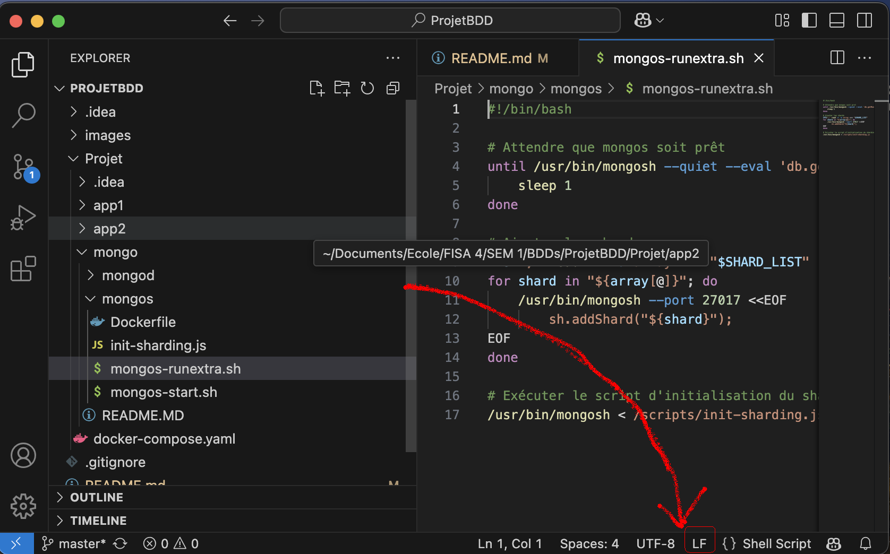

# README - Système de Gestion d'Adhérents pour une Association

Projet réalisé par :

- Desticourt Matt

- Bouchedhomme Alexis

- Choquet Mathias

- Delhoute Clara

# Objectif du Projet

L'objectif de ce projet est de mettre en place un système de gestion des adhérents d'une association qui possède plusieurs antennes ("groupes"). Cette association gère du matériel informatique destiné au reconditionnement. Le projet comprend la mise en place d'une base de données distribuée et d'un système de gestion applicative connecté à une instance MongoDB exécutée via Docker.

# Structure des Données

Le système gère les entités suivantes :

- Membre : nom, prénom, adresse (numéro, rue, ville, code postal), email

- Groupe : numéro (G1, G2, ...), nom, ville, code postal

- Matériel : numéro de série, marque, modèle, type (ex: écran, clavier, souris, tour, laptop, enceintes), prix

Commande :

Client (Membre)

Actif (Membre responsable de la vente)

Date

Liste de matériels

Prix total

# Fonctionnalités Implémentées

Nous avons développé deux applications distinctes pour réaliser les tâches suivantes :

## Application de gestion principale :

Inscription des Membres

- Création des Groupes

- Ajout de Matériel

- Login simple (vérification login/mot de passe sans sécurité approfondie)

- Passation de commandes par les Membres Clients

## Application d'archivage et de recherche des commandes :

- Recherche par plage de dates

- Recherche par Membre Client

- Recherche par Membre Actif

- Recherche par Matériel

# Infrastructure Technique

Base de Données Distribuée avec MongoDB et Docker

Utilisation de MongoDB comme base de données principale, imposée par contrat fournisseur.

Mise en place de Replica Sets pour assurer la redondance et la fiabilité des données.

Utilisation de Docker pour déployer les bases et garantir un environnement stable.

# Technologies Utilisées

- Backend : Java

- Base de données : MongoDB

- Infrastructure : Docker, Docker Compose

- Frontend : Thymeleaf

# Installation et Lancement

## Attention

⚠️ Nous initialisons nos Docker avec des scripts `.sh` (shell) pour compléter automatiquement notre base de données. ⚠️

Si vous travaillez sur Windows, Git change le format des fins de ligne du format LF vers CRLF. Il est donc indispensable, si vous déployez nos Docker sur GitHub, de modifier le format des fins de lignes **manuellement** dans votre IDE pour les fichiers suivants :

(Globalement tout ce qui se trouve dans le répertoire `mongod` et `mongos` dans `/Projet/mongo/`)

- /Projet/mongo/mongod/mongod-runextra.sh
- /Projet/mongo/mongod/mongod-start.sh
- /Projet/mongo/mongod/mongod.conf

Ainsi que dans les fichiers suivants:

- /Projet/mongo/mongos/init-sharding.js
- /Projet/mongo/mongos/mongos-runextra.sh
- /Projet/mongo/mongos/mongos-start.sh

Dans Visual Studio Code:
| Before | After |
| --- | --- |
|   |  |

## Déploiement

Clonez le dépôt puis diriger vous dans le dossier dans lequel vous avez clonne le projet et dans le sous-répertoire Projet

Lancez les containers :

docker-compose up -d

Accédez aux applications via :

Interface de gestion principale : http://localhost:8083

Interface d'archivage et de recherche : http://localhost:8081/dashboard

# Comment passer une commande 

⚠️ Créer votre compte en tant que membre client -> La bdd ne possède aucun vendeur, créer un membre actif depuis l'interface d'ajout un membrre puis créer un matériel et ensuite vous pourrez passer commande ⚠️

# Améliorations Futures

- Ajout de la sécurité sur les connexions utilisateurs

- Optimisation des performances de la base de données

- Interface utilisateur améliorée

# Fonctionnalités manquantes 

- Dans l'application dashboard des commandes (étape 4), seul la recherche par date est fonctionnelle.
- Un matériel n'est pas lié à un groupe.
- Le matériel et les commandes ne possèdent pas de champ code postal, il ne sont donc pas shardés sur les réplicats correspondants.

# Conclusion

Ce projet fournit une solution efficace et fiable pour la gestion des adhérents, du matériel et des commandes d'une association de reconditionnement informatique. L'utilisation de MongoDB en environnement Docker permet d'assurer la persistance et la disponibilité des données.
